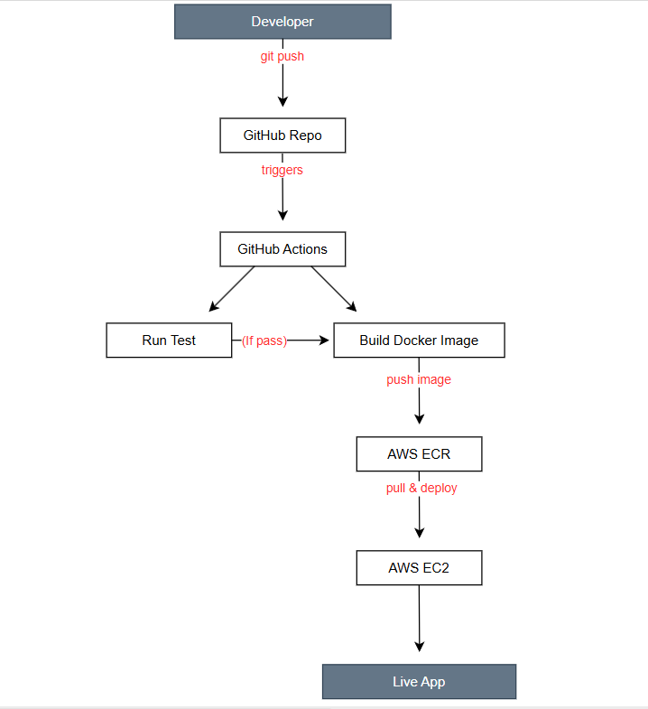

# Flask CI/CD Pipeline 🚀

Automated CI/CD pipeline for a Python Flask application using 
GitHub Actions, Docker, AWS ECR, and AWS EC2.

## Pipeline Flow
Push code → Run Tests → Build Docker Image → Push to ECR → Deploy to EC2

## Tech Stack
- Python Flask
- Docker
- GitHub Actions
- AWS ECR (Container Registry)
- AWS EC2 (Deployment Server)

## Live Demo
App running at: http://3.105.229.47:5000

## Architecture

